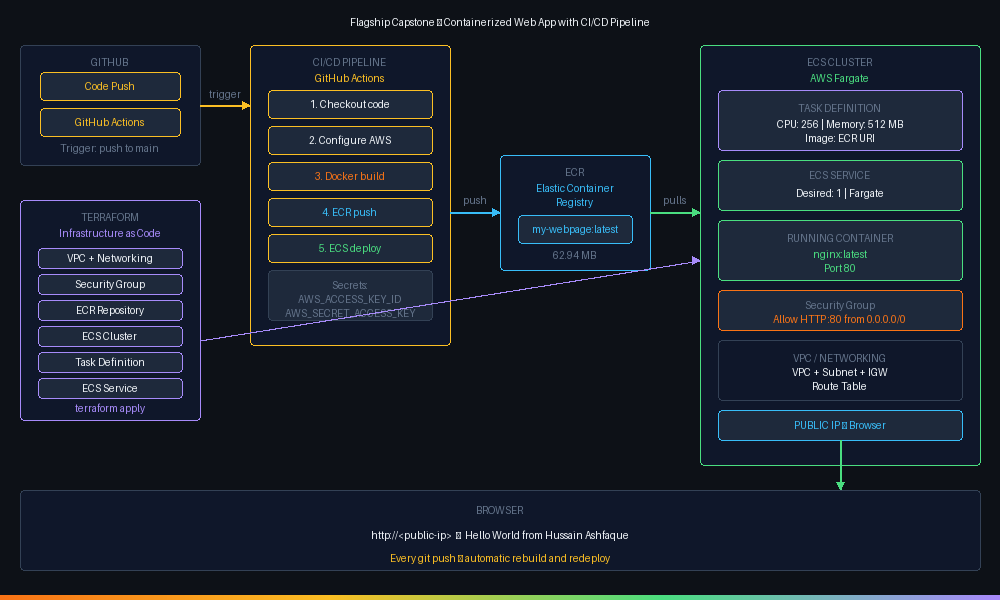

# Flagship Capstone — Containerized Web App with CI/CD Pipeline

## Overview

A production-style deployment pipeline combining Terraform, Docker, ECR, ECS Fargate, and GitHub Actions. Every push to the main branch automatically builds, pushes, and redeploys the containerized web app on AWS — no manual steps required.

---

## Architecture Diagram



---

## What This Project Does

1. Developer pushes code to GitHub
2. GitHub Actions automatically:
   - Builds a new Docker image
   - Pushes it to Amazon ECR
   - Forces ECS to redeploy with the new image
3. The updated app is live at the public IP within minutes

---

## Tech Stack

| Tool | Purpose |
|---|---|
| Terraform | Provisions all AWS infrastructure as code |
| Docker | Packages the web app into a container |
| Amazon ECR | Stores Docker images |
| Amazon ECS + Fargate | Runs containers — no EC2 to manage |
| GitHub Actions | Automates the build and deploy pipeline |

---

## Infrastructure (Terraform)

All 12 AWS resources provisioned with a single `terraform apply`:

```
VPC (10.0.0.0/16)
├── Internet Gateway
├── Public Subnet (10.0.1.0/24) — us-west-1c
│   └── Route Table (0.0.0.0/0 → IGW)
├── Security Group (allow HTTP :80)
└── ECS Cluster (capstone-cluster)
    ├── ECR Repository (my-webpage)
    ├── IAM Execution Role
    ├── Task Definition (0.25 vCPU / 512 MB)
    └── ECS Service (desired: 1, Fargate)
```

---

## Application

A simple nginx web server serving a custom HTML page:

```dockerfile
FROM nginx
COPY index.html /usr/share/nginx/html/index.html
```

---

## CI/CD Pipeline (GitHub Actions)

**Trigger:** Push to `main` branch

**Steps:**
1. Checkout code
2. Configure AWS credentials (via GitHub Secrets)
3. Build Docker image
4. Push to ECR
5. Force new ECS deployment

**GitHub Secrets required:**
- `AWS_ACCESS_KEY_ID`
- `AWS_SECRET_ACCESS_KEY`

---

## Setup

### 1. Deploy infrastructure
```bash
cd terraform
terraform init
terraform apply
```

### 2. Build and push initial image
```powershell
aws ecr get-login-password --region us-west-1 | Out-String | docker login --username AWS --password-stdin <account-id>.dkr.ecr.us-west-1.amazonaws.com
docker build -t my-webpage .
docker tag my-webpage:latest <ecr-uri>:latest
docker push <ecr-uri>:latest
```

### 3. Push to GitHub — pipeline runs automatically
```bash
git add .
git commit -m "update app"
git push origin main
```

---

## Cleanup

```bash
terraform destroy
```

Deletes all 12 AWS resources.

---

## Key Learnings

- Terraform provisions the entire infrastructure from scratch with one command
- ECS pulls the image from ECR — the repository must have an image before the service can start
- GitHub Secrets securely pass AWS credentials to the pipeline without hardcoding
- `terraform destroy` cleanly removes everything — no orphaned resources
- The CI/CD pipeline removes all manual deployment steps — push code, it deploys itself
